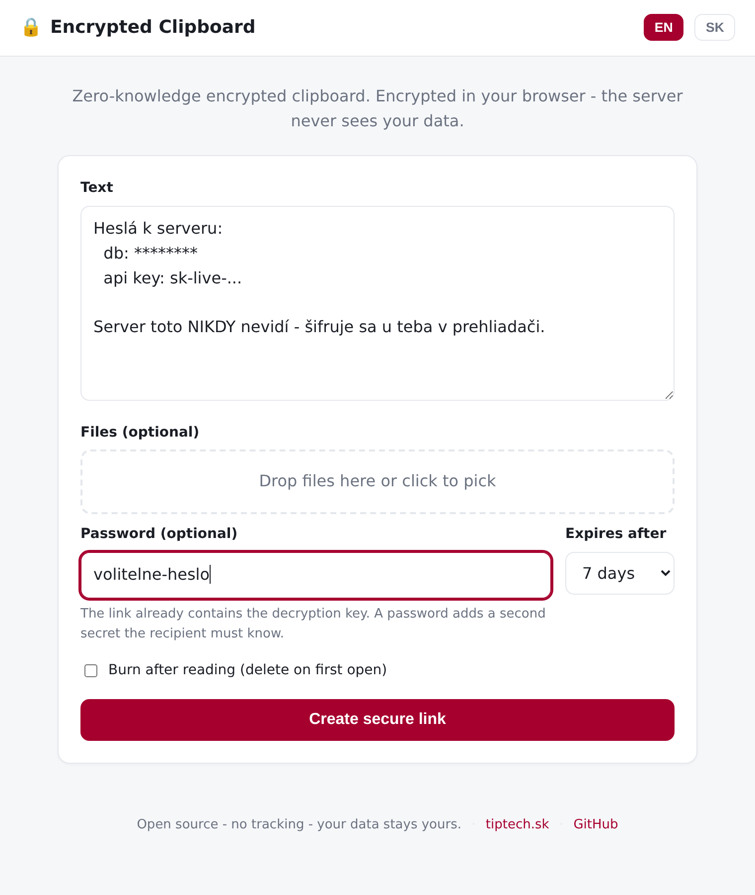

# Encrypted Clipboard

**Zero-knowledge encrypted clipboard.** Paste text or drop files, get one share
link. Everything is encrypted in the browser before it leaves your device, so
the server only ever stores a blob it cannot read. No master key, no admin
backdoor, no tracking.

> Built and run by [tiptech.sk](https://tiptech.sk). Try the live instance, or
> self-host it in one command.



## Why

Most "paste and share" tools can read everything you paste. This one cannot,
**by design**:

- The decryption key is generated in your browser and lives only in the URL
  fragment (`#...`), which browsers never send to the server.
- The server stores ciphertext plus a salt and IV. There is no key on the
  server and no decryption code path. Even if the box is fully compromised, the
  content stays unreadable.
- An optional password adds a second secret on top of the link.

It is the [PrivateBin](https://privatebin.info/) model, kept deliberately small:
one Python file, no third-party dependencies, a vanilla-JS frontend, no build step.

## Features

- AES-256-GCM, key derived with PBKDF2-HMAC-SHA256 (310k iterations) - all via
  the browser Web Crypto API.
- Text **and** files in one encrypted bundle (filenames and types are encrypted too).
- Optional password as a second factor.
- Expiry: 1 hour / 1 day / 7 / 30 days / never.
- **Burn after reading** (deleted on first open; safe against link-preview bots).
- Built-in math anti-bot check and per-IP rate limiting.
- English and Slovak UI out of the box; add a language by editing one file.
- Single-process, SQLite-backed, runs anywhere Python runs. Docker image included.

## Quick start

### Docker

```bash
docker compose up -d
# open http://localhost:8470
```

Set `CLIPBOARD_BASE_URL` to your real domain when running behind a reverse proxy.

### Plain Python (no dependencies)

```bash
python3 server.py
# open http://localhost:8470
```

Requires only Python 3.8+. That is the entire dependency list.

## Configuration

All optional, via environment variables (see `config.example.env`):

| Variable | Default | Description |
|----------|---------|-------------|
| `CLIPBOARD_HOST` | `0.0.0.0` | Listen address |
| `CLIPBOARD_PORT` | `8470` | Listen port |
| `CLIPBOARD_BASE_URL` | `http://localhost:PORT` | Public URL used in share links |
| `CLIPBOARD_DATA_DIR` | `./data` | SQLite + encrypted blobs |
| `CLIPBOARD_MAX_MB` | `20` | Max encrypted payload size |
| `CLIPBOARD_CAPTCHA` | `1` | Math anti-bot check on create |
| `CLIPBOARD_RATE_CREATE` | `30` | Max creates per IP per 10 min |
| `CLIPBOARD_DEFAULT_EXPIRY` | `7d` | Preselected expiry |

### Behind a reverse proxy

The app sets no cookies and serves its own static files. Example Caddy config:

```
clip.example.com {
    reverse_proxy 127.0.0.1:8470
}
```

Pass the visitor IP through (`X-Forwarded-For` / `X-Real-IP`) so rate limiting
works. Caddy does this automatically.

## How it works

```
 Browser                                   Server
 -------                                    ------
 random 256-bit key  ─┐
 password (optional) ─┤
                      ├─PBKDF2─▶ AES-GCM key
 text + files ───────────────▶ encrypt ──▶ ciphertext ──POST──▶ store blob (cannot read)
                                                                 returns id
 share link = https://host/c/<id>#<key>
                                  └── key stays in the fragment, never sent

 Open link ──POST id──▶ server returns ciphertext
 key from #fragment + password ──▶ decrypt in browser ──▶ show content
```

See [docs/SECURITY.md](docs/SECURITY.md) for the full security model and the
zero-knowledge trade-off (no server-side content scanning).

## Tests

```bash
bash test/run.sh        # crypto + server round-trip (Node 20, no browser needed)
```

The suite runs the exact same `static/crypto.js` the browser uses against a live
server and verifies: round-trip decryption, that the stored blob never contains
the plaintext, wrong-key and wrong-password failure, burn-after-reading, delete
tokens, and size limits. A separate headless-browser suite covers the full UI.

## Project layout

```
server.py            single-file stdlib server (storage + API + static)
static/
  index.html         UI
  app.js             UI logic
  crypto.js          Web Crypto encrypt/decrypt (browser + Node)
  i18n.js            English + Slovak strings
  style.css
test/                end-to-end crypto + server tests
docs/SECURITY.md     security model
Dockerfile, docker-compose.yml
```

## License

MIT - see [LICENSE](LICENSE).
